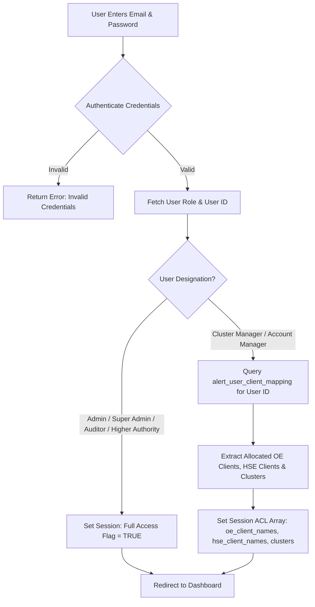

# Implementation Plan: Client-Wise ACL & Audit Historical Snapshot System

> **Constraint Notice**: This document contains ONLY the analysis and implementation plan. **No code, database, UI, or configuration changes have been executed.**

---

## 1. Current Architecture & Structure Analysis

### 1.1 Existing Structure Overview
The application is built on **CodeIgniter 4** (PHP 8.2) with a MySQL database. Key system structures currently include:

* **User Master (`alert_users`)**:
  * Contains fields: `user_id`, `user_name`, `user_email`, `user_designation`, `user_region`, `user_cluster`, `user_location`, `region_id`, `cluster_id`, `location_id`.
  * **Limitation**: Currently stores only a **single** region/cluster/location string or ID per user. It cannot natively hold multiple client or site allocations for a single user.

* **Client Masters (`alert_client` & `alert_hse_client_master`)**:
  * OE Client (`alert_client`): Stores `client_id`, `client_name`, `location`, `region`, `cluster`, `account_manager`.
  * HSE Client (`alert_hse_client_master`): Stores `client_id`, `client_name`, `location`, `region`, `cluster`, `account_manager`, `category`, `sub_category`.
  * Location Master (`alert_location_master`): Central location dictionary mapped to OE and HSE.

* **Audit Master Tables**:
  * OE Audit (`alert_final_structured_audit`)
  * OE Normal Audit (`alert_normal_audit`)
  * HSE Audit (`alert_hse_audit_master`)
  * Gemba Audit (`alert_gemba_audits`)

* **Existing Access Control Mechanism (`designation_acl_helper.php` & `hse_acl_helper.php`)**:
  * Currently, ACL filtering for **Cluster Manager** searches `alert_client` or `alert_hse_client_master` where `LOWER(TRIM(cluster)) = LOWER(TRIM(user_name))` (matching user name to cluster name string).
  * ACL filtering for **Account Manager** searches `alert_client` or `alert_hse_client_master` where `LOWER(TRIM(account_manager)) = LOWER(TRIM(user_name))` (matching user name to account manager string).

### 1.2 Identified Architectural Deficits & Critical Risks

1. **Single-Client / String-Based Allocation**:
   * Allocation relies on string comparison between `alert_users.user_name` and client table string columns (`account_manager` or `cluster`).
   * Unable to assign **multiple distinct OE / HSE clients** to a single user via standard user management UI.
   * If a user's name is updated or misspelled, access control breaks silently across all modules.

2. **CRITICAL RISK: Historical Audit Integrity Bug in Dependency Sync**:
   * `ClientSiteDependencySyncService.php` currently runs SQL `UPDATE` queries on historical audit tables (`alert_final_structured_audit`, `alert_normal_audit`, `alert_hse_audit_master`, `alert_gemba_audits`) whenever a client's `account_manager` or `cluster` is modified in `Masters/Client` or `Masters/Hse_client`.
   * **Impact**: If Client A's Account Manager changes from *Manager 1* to *Manager 2*, the existing sync service overwrites *Manager 1* with *Manager 2* across all past completed audits! This directly violates audit compliance and historical record requirements.

---

## 2. Proposed User → Multiple Clients Mapping Architecture

### 2.1 Multi-Client Junction Table (`alert_user_client_mapping`)
To decouple allocation from string-matching and allow **One User → Multiple Clients**, we will introduce a dedicated relational mapping table.

```
+-----------------------------------------------------------------------------------+
|                            alert_user_client_mapping                              |
+-------------------+------------------+-------------------+------------------------+
| user_id (FK)      | client_id (FK)   | client_type       | cluster_name           |
| (alert_users)     | (client master)  | ('OE' / 'HSE')    | (Denormalized)         |
+-------------------+------------------+-------------------+------------------------+
```

### 2.2 Key Principles:
1. **Designation Support**: Applicable specifically for **Cluster Manager** and **Account Manager** designations (Admin / Super Admin / Higher Authority / Auditor bypass client restriction).
2. **Module-Wise Allocation**: A user can be assigned multiple OE clients and/or multiple HSE clients.
3. **Data Isolation**: Upon login, session filters are initialized strictly from `alert_user_client_mapping`. Users will ONLY see data for allocated clients/sites.

---

## 3. Proposed Database Schema Changes

### 3.1 New Table: `alert_user_client_mapping`
```sql
CREATE TABLE IF NOT EXISTS `alert_user_client_mapping` (
  `mapping_id` INT AUTO_INCREMENT PRIMARY KEY,
  `user_id` INT NOT NULL,
  `client_id` INT NOT NULL,
  `client_type` ENUM('OE', 'HSE') NOT NULL DEFAULT 'OE',
  `client_name` VARCHAR(255) NOT NULL,
  `cluster_name` VARCHAR(255) NULL,
  `region_name` VARCHAR(255) NULL,
  `created_by` INT NULL,
  `created_at` DATETIME NOT NULL DEFAULT CURRENT_TIMESTAMP,
  `status` TINYINT(1) NOT NULL DEFAULT 1,
  INDEX `idx_user_type` (`user_id`, `client_type`),
  INDEX `idx_client` (`client_id`, `client_type`),
  CONSTRAINT `fk_user_client_user` FOREIGN KEY (`user_id`) REFERENCES `alert_users`(`user_id`) ON DELETE CASCADE
) ENGINE=InnoDB DEFAULT CHARSET=utf8mb4;
```

### 3.2 Audit Master Tables Snapshot Columns Addition
To maintain **historical Account Manager / Cluster Manager information for each particular audit**, we will add immutable snapshot columns to all audit master tables.

#### A. `alert_final_structured_audit` (OE Structured Audit)
```sql
ALTER TABLE `alert_final_structured_audit`
  ADD COLUMN `snapshot_client_id` INT NULL AFTER `client_name`,
  ADD COLUMN `snapshot_account_manager_id` INT NULL AFTER `client_manager_name`,
  ADD COLUMN `snapshot_account_manager_name` VARCHAR(255) NULL AFTER `snapshot_account_manager_id`,
  ADD COLUMN `snapshot_cluster_manager_id` INT NULL AFTER `cluster_name`,
  ADD COLUMN `snapshot_cluster_manager_name` VARCHAR(255) NULL AFTER `snapshot_cluster_manager_id`,
  ADD COLUMN `snapshot_created_by_user_id` INT NULL AFTER `audit_by_user_id`,
  ADD COLUMN `snapshot_created_by_user_name` VARCHAR(255) NULL AFTER `snapshot_created_by_user_id`,
  ADD COLUMN `snapshot_created_at` DATETIME NULL AFTER `default_date`;
```

#### B. `alert_normal_audit` (OE Normal Audit)
```sql
ALTER TABLE `alert_normal_audit`
  ADD COLUMN `snapshot_client_id` INT NULL AFTER `client_name`,
  ADD COLUMN `snapshot_account_manager_id` INT NULL AFTER `client_manager_name`,
  ADD COLUMN `snapshot_account_manager_name` VARCHAR(255) NULL AFTER `snapshot_account_manager_id`,
  ADD COLUMN `snapshot_cluster_manager_id` INT NULL AFTER `cluster_name`,
  ADD COLUMN `snapshot_cluster_manager_name` VARCHAR(255) NULL AFTER `snapshot_cluster_manager_id`,
  ADD COLUMN `snapshot_created_by_user_id` INT NULL AFTER `audit_by_user_id`,
  ADD COLUMN `snapshot_created_by_user_name` VARCHAR(255) NULL AFTER `snapshot_created_by_user_id`,
  ADD COLUMN `snapshot_created_at` DATETIME NULL AFTER `default_date`;
```

#### C. `alert_hse_audit_master` (HSE Audit)
```sql
ALTER TABLE `alert_hse_audit_master`
  ADD COLUMN `snapshot_client_id` INT NULL AFTER `client_name`,
  ADD COLUMN `snapshot_account_manager_id` INT NULL AFTER `account_manager`,
  ADD COLUMN `snapshot_account_manager_name` VARCHAR(255) NULL AFTER `snapshot_account_manager_id`,
  ADD COLUMN `snapshot_cluster_manager_id` INT NULL AFTER `cluster_name`,
  ADD COLUMN `snapshot_cluster_manager_name` VARCHAR(255) NULL AFTER `snapshot_cluster_manager_id`,
  ADD COLUMN `snapshot_created_by_user_id` INT NULL AFTER `perform_audit_by`,
  ADD COLUMN `snapshot_created_by_user_name` VARCHAR(255) NULL AFTER `snapshot_created_by_user_id`,
  ADD COLUMN `snapshot_created_at` DATETIME NULL AFTER `default_date`;
```

#### D. `alert_gemba_audits` (Gemba Audit)
```sql
ALTER TABLE `alert_gemba_audits`
  ADD COLUMN `snapshot_site_id` INT NULL AFTER `site_name`,
  ADD COLUMN `snapshot_account_manager_id` INT NULL AFTER `account_manager`,
  ADD COLUMN `snapshot_account_manager_name` VARCHAR(255) NULL AFTER `snapshot_account_manager_id`,
  ADD COLUMN `snapshot_cluster_manager_id` INT NULL AFTER `cluster_manager_spoc`,
  ADD COLUMN `snapshot_cluster_manager_name` VARCHAR(255) NULL AFTER `snapshot_cluster_manager_id`,
  ADD COLUMN `snapshot_created_by_user_id` INT NULL AFTER `created_by`,
  ADD COLUMN `snapshot_created_by_user_name` VARCHAR(255) NULL AFTER `snapshot_created_by_user_id`,
  ADD COLUMN `snapshot_created_at` DATETIME NULL AFTER `default_date`;
```

---

## 4. Login & Session ACL Flow



### 4.1 Session Data Structure (`Login.php` -> `create_user_session()`)
When a user logs in, the session will be initialized with the following structure:

```php
$_SESSION['user_acl'] = [
    'is_restricted'     => (isClusterManager() || isAccountManager()),
    'designation'       => $userData['user_designation'],
    'oe_client_ids'     => [1, 4, 12],
    'oe_client_names'   => ['Client A', 'Client B', 'Client C'],
    'hse_client_ids'    => [5, 8],
    'hse_client_names'  => ['HSE Site Alpha', 'HSE Site Beta'],
    'allocated_clusters'=> ['Cluster West 1', 'Cluster North 2'],
];
```

---

## 5. Client-Wise Query & API Filtering Approach

### 5.1 Centralized Helper Refactoring (`designation_acl_helper.php` & `hse_acl_helper.php`)
Instead of legacy string-matching against usernames, ACL helper functions will read directly from the session ACL array:

```php
function getACLAllocatedOeClients(): array {
    return session()->get('user_acl.oe_client_names') ?? [];
}

function getACLAllocatedHseClients(): array {
    return session()->get('user_acl.hse_client_names') ?? [];
}

function getACLAllocatedClusters(): array {
    return session()->get('user_acl.allocated_clusters') ?? [];
}

function applyClientACLFilter($builder, string $moduleType = 'OE', string $clientCol = 'client_name', string $clusterCol = 'cluster_name') {
    if (!session()->get('user_acl.is_restricted')) {
        return $builder; // Admins / Auditors see all
    }
    
    if ($moduleType === 'OE') {
        $clients = getACLAllocatedOeClients();
        if (empty($clients)) {
            $builder->where('1=0', null, false);
        } else {
            $builder->whereIn($clientCol, $clients);
        }
    } else if ($moduleType === 'HSE') {
        $clients = getACLAllocatedHseClients();
        if (empty($clients)) {
            $builder->where('1=0', null, false);
        } else {
            $builder->whereIn($clientCol, $clients);
        }
    }
    return $builder;
}
```

### 5.2 Application Matrix for Filtering

| Module / Screen | File / Controller | Action Required |
| :--- | :--- | :--- |
| **OE Audit List & Datatable** | `Audit_final_structure.php` | Apply `applyClientACLFilter($builder, 'OE')` to `table_ajax()`, `normal_audit_structure()`, and counts. |
| **HSE Audit List & Datatable** | `Hse_audit.php` | Apply `applyClientACLFilter($builder, 'HSE')` to `table_ajax()` and count queries. |
| **Gemba Audit List** | `GembaAudit.php` | Apply `apply_gemba_role_filters()` using `hse_client_names`. |
| **NC Trackers (OE / HSE / Gemba)** | `Oe_nc_tracker.php`, `Hse_nc_tracker.php`, `GembaNcTracker.php`, `Client_nc_tracker.php`, `Inplant_nc_tracker.php`, `Normal_nc_tracker.php` | Filter NC rows by allocated client names in data query and status card queries. |
| **Dashboards** | `Dashboard.php`, `Oe_dashboard.php`, `Structure_audit_dashboard.php`, `Audit_template_dashboard.php` | Scope all chart data, summary cards, and score calculations to allocated clients only. |
| **Master Management** | `Client.php`, `Hse_client.php`, `GembaSites.php` | Restrict Account Managers / Cluster Managers to view only allocated clients in client list. |
| **Exports & Downloads** | Excel/CSV/PDF export methods across all controllers | Enforce same client ACL filter on query builder prior to generation. |

---

## 6. Audit Historical Snapshot Approach

### 6.1 Audit Creation Workflow (`save_perform_audit` & `save_audit_view`)
When an audit is performed and submitted:

```text
Client Allocation Lookup at Audit Execution Time:
Client Master / User-Client Mapping
   │
   ├── Fetch Current Account Manager (User ID & Name)
   └── Fetch Current Cluster Manager (User ID & Name)
   │
   ▼
Save Audit Master Record
   ├── client_name / location
   ├── snapshot_client_id
   ├── snapshot_account_manager_id & snapshot_account_manager_name
   ├── snapshot_cluster_manager_id & snapshot_cluster_manager_name
   ├── snapshot_created_by_user_id & snapshot_created_by_user_name
   └── snapshot_created_at
```

### 6.2 Modifying `ClientSiteDependencySyncService.php` (Crucial Fix)
To enforce that historical audits NEVER change manager values when a client's manager is updated:

1. **Remove Manager Updates on Audit Tables**: Remove the statements in `syncOeClientChanges()`, `syncHseClientChanges()`, and `syncLocationMasterChanges()` that update `client_manager_name`, `account_manager`, or `cluster_name` in `alert_final_structured_audit`, `alert_normal_audit`, `alert_hse_audit_master`, and `alert_gemba_audits`.
2. **Retain Rename Sync Only**: `ClientSiteDependencySyncService` will ONLY synchronize location/client name renames (when explicitly renamed in master) and status changes, keeping historical manager snapshots untouched.

### 6.3 Audit Detail & PDF Display Logic
All audit detail views (`Audit_final_structure/auditViewDetailsPdf`, `Hse_audit/auditNormalDetailsPdf`, `capa_report`, `perform_audit_view_pdf.php`) will read strictly from the audit master's `snapshot_*` columns:

```php
// Render historical Account Manager & Cluster Manager saved at audit execution time
$accountManager = $audit['snapshot_account_manager_name'] ?? $audit['client_manager_name'] ?? 'N/A';
$clusterManager = $audit['snapshot_cluster_manager_name'] ?? $audit['cluster_name'] ?? 'N/A';
```

---

## 7. Action & User Tracking Approach

For every major audit operation (Create, Edit, Reaudit, Status Update, NC Closure, Delete), the system will record:

1. `created_by` / `snapshot_created_by_user_id`: ID of the logged-in user who initiated the audit.
2. `updated_by` / `updated_by_user_id`: ID of the user performing an edit/update.
3. `nc_closed_by` / `nc_closed_by_user`: ID and name of the user closing an NC.
4. `action_by` / `action_by_user_id`: User executing re-audit or approval actions.
5. Timestamp tracking: `created_at`, `updated_at`, `nc_closed_date`.

Historical user tracking values will be write-once/immutable and will not be overwritten by subsequent client manager reassignments.

---

## 8. Modules Affected (Comprehensive List)

```
[System Architecture]
 ├── Authentication & Session: Login.php, Authentication.php, BaseController.php
 ├── User Management: User.php, views/Master/add_user.php
 ├── Client Management: Client.php, Hse_client.php, GembaSites.php
 ├── Synchronization Service: ClientSiteDependencySyncService.php
 ├── Helpers: designation_acl_helper.php, hse_acl_helper.php, gemba_acl_helper.php, simple_acl_helper.php
 ├── Audit Modules:
 │    ├── OE Audit: Audit_template.php, Audit_final_structure.php
 │    ├── HSE Audit: Hse_audit.php
 │    └── Gemba Audit: GembaAudit.php
 ├── NC Trackers:
 │    ├── Oe_nc_tracker.php, Hse_nc_tracker.php, GembaNcTracker.php
 │    ├── Client_nc_tracker.php, Inplant_nc_tracker.php, Normal_nc_tracker.php, Fm_nc_tracker.php
 ├── Dashboards & Reports:
 │    ├── Dashboard.php, Oe_dashboard.php, Structure_audit_dashboard.php, Audit_template_dashboard.php
 │    └── Reports/* (All custom report controllers)
 └── PDF & Export Services: Dompdf generators, CSV/Excel export methods
```

---

## 9. Security & API Validation Requirements

To prevent **Direct URL / Parameter Tampering** (IDOR - Insecure Direct Object Reference):

1. **Controller-Level Ownership Verification**:
   Before rendering or processing any record by ID (e.g., `Audit_final_structure/auditViewDetailsPdf/$id`, `Hse_audit/audit_view/$id`, `GembaAudit/edit/$id`):

   ```php
   $audit = $this->fetchAuditRecord($id);
   if (isClusterManager() || isAccountManager()) {
       $allowedClients = getACLAllocatedOeClients(); // or HSE
       if (!in_array($audit['client_name'], $allowedClients)) {
           throw \CodeIgniter\Exceptions\PageNotFoundException::forPageNotFound("Access Denied: You do not have access to this client record.");
       }
   }
   ```

2. **API Endpoint Filtering**:
   All DataTables AJAX endpoints (`table_ajax`), dropdown dependency APIs (`get_dependency_data`), and export endpoints (`gemba_export`, `exportExcel`) MUST check the session ACL and reject queries for unallocated client IDs.

---

## 10. Migration & Backward-Compatibility Plan

### Phase 1: Database Migration
* Execute DDL scripts to create `alert_user_client_mapping` and add snapshot columns to audit master tables.

### Phase 2: Data Backfilling Script
* **User-Client Allocation Seed**: Run a one-time PHP migration script to populate `alert_user_client_mapping` by matching existing `alert_client.account_manager` and `alert_client.cluster` values to active `alert_users` records.
* **Audit Snapshot Seed**: Backfill `snapshot_account_manager_name` and `snapshot_cluster_manager_name` on existing audit records using their existing `client_manager_name` and `cluster_name` values.

### Phase 3: Rollout Strategy
* Deploy updated helpers and session logic.
* Zero downtime: Existing admin users remain unaffected; Cluster Managers and Account Managers immediately transition from name-matching to table-driven ACL.

---

## 11. Verification & Testing Checklist

### Scenario 1: Multi-Client User Allocation
- [ ] Log in as Admin -> Go to User Master (`Masters/User`).
- [ ] Edit a Cluster Manager user -> Verify multi-select dropdown allows assigning Client A, Client B, and Client C.
- [ ] Edit an Account Manager user -> Assign multiple OE and HSE clients.
- [ ] Save and verify entries in `alert_user_client_mapping`.

### Scenario 2: Login-Based ACL Enforcement
- [ ] Log in as Cluster Manager (assigned Client A & B only).
- [ ] Navigate to OE Audit List, HSE Audit List, NC Tracker, and Dashboard.
- [ ] Verify ONLY Client A & B data/metrics appear. Client C/D data must NOT be visible.
- [ ] Verify summary cards and counters match only allocated clients.

### Scenario 3: Audit Historical Snapshot Preservation (Crucial Test)
- [ ] Client A currently has Account Manager = **Manager 1**.
- [ ] Perform OE Audit for Client A -> Verify audit is saved with Manager 1.
- [ ] Go to Client Master (`Masters/Client`) -> Change Client A's Account Manager to **Manager 2**.
- [ ] Perform NEW OE Audit for Client A -> Saved with Manager 2.
- [ ] View OLD OE Audit (View & PDF) -> **Must continue displaying Manager 1**.
- [ ] View NEW OE Audit (View & PDF) -> Displays Manager 2.

### Scenario 4: Direct URL & API Tamper Resistance
- [ ] Log in as Manager assigned to Client A only.
- [ ] Attempt to access URL for Client B audit: `/Masters/Audit_final_structure/auditViewDetailsPdf/<Client_B_Audit_ID>`.
- [ ] Verify system rejects request with **Access Denied / 403 Forbidden**.

### Scenario 5: Export ACL Verification
- [ ] Log in as restricted manager -> Click CSV / Excel Export on Gemba / OE / HSE audit lists.
- [ ] Inspect downloaded CSV -> Verify exported rows contain ONLY allocated client records.

---

## Open Questions / Clarifications

> [!NOTE]
> 1. **Client ID vs Location ID Mapping**: In some historical modules (e.g. HSE and Gemba), `location` or `site_name` string is used as the primary identifier instead of numeric `client_id`. The proposed mapping table handles both `client_id` and denormalized `client_name` / `location` to ensure seamless compatibility across all legacy modules.
> 2. **Super Admin / Auditor Access**: As confirmed by current permissions, Super Admin, Higher Authority, and Auditor roles will retain global read/write access and bypass client-wise restriction.
